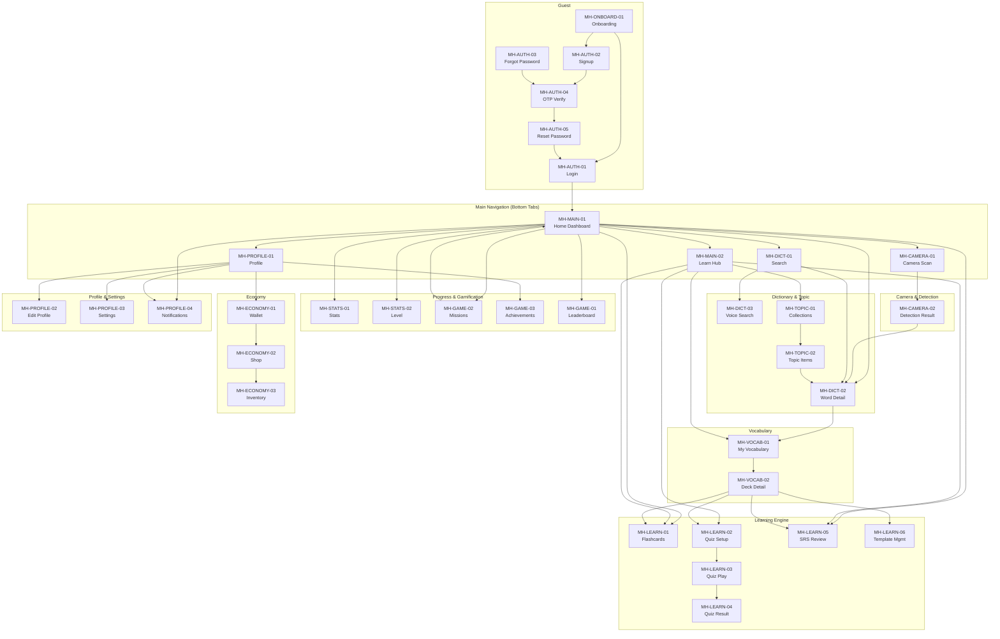

# Phân rã màn hình — SnapVocab

> Truy vết: [specs.md](./specs.md) · [buss_mainflow.md](./buss_mainflow.md) · [phan_ra_tinh_nang.md](./phan_ra_tinh_nang.md) · [phan_ra_phan_he_he_thong.md](./phan_ra_phan_he_he_thong.md).  
> **Canonical:** Florence-2 pipeline · Deck/Note/Card · Actor Guest/Learner/Admin.

---

## 1. Phạm vi màn hình theo milestone

| Nhóm MH                                  | MVP M1–M4    | Ghi chú                         |
| ---------------------------------------- | ------------ | ------------------------------- |
| ONBOARD, AUTH, MAIN, CAMERA, DICT, TOPIC | **In scope** | M1–M2                           |
| LEARN (Flashcard, Quiz, SRS)             | **In scope** | M1 (basic), M3 (full)           |
| STATS, PROGRESS                          | **In scope** | M3                              |
| GAME, ECONOMY                            | **M4**       | Coin only, no real payment      |
| PROFILE, NOTIFICATION, SETTINGS          | **In scope** | M1 (profile), M3 (notification) |
| Admin CMS screens                        | **Tách web** | Không nằm mobile; FR-13, SS-17  |
| SYSTEM (Design System, UI States)        | **Ongoing**  | Cross-cutting, cần từ M1        |

**Thuật ngữ UI:** "Vocabulary / từ đã lưu" = danh sách `Note` trong `Deck`. Word Detail save → Note + Card.

---

## 2. Quy ước mã màn hình

```text
MH-{GROUP}-{nn}
```

| Nhóm    | Ý nghĩa                                             | Milestone |
| ------- | --------------------------------------------------- | --------- |
| ONBOARD | Onboarding/welcome cho Guest                        | M1        |
| AUTH    | Login, signup, forgot password, OTP, reset password | M1        |
| MAIN    | Home Dashboard, Learn Hub                           | M1        |
| CAMERA  | Camera Scan và Detection Result                     | M2        |
| DICT    | Search, Word Detail, Voice Search                   | M1        |
| TOPIC   | Collections, Topic List, Topic Items                | M1        |
| VOCAB   | My Vocabulary (Deck/Note list), Deck Detail         | M1        |
| LEARN   | Flashcards, Quiz, SRS Review, Template Management   | M1, M3    |
| STATS   | Stats/Progress, Level                               | M3        |
| GAME    | Missions, Achievements, Leaderboard, Rewards        | M4        |
| ECONOMY | Wallet, Shop, Inventory                             | M4        |
| PROFILE | Profile, Edit Profile, Settings, Notifications      | M1, M3    |
| SYSTEM  | Design System, Loading/Empty/Error States           | Ongoing   |

---

## 3. Sơ đồ điều hướng tổng quan



---

## 4. Danh sách màn hình tổng quan

| Mã            | Tên màn hình               | Actor   | Feature Area            | Milestone | Trạng thái            |
| ------------- | -------------------------- | ------- | ----------------------- | --------- | --------------------- |
| MH-ONBOARD-01 | Onboarding                 | Guest   | AUTH                    | M1        | Chưa thiết kế (Figma) |
| MH-AUTH-01    | Login                      | Guest   | AUTH                    | M1        | Chưa thiết kế (Figma) |
| MH-AUTH-02    | Signup/Register            | Guest   | AUTH                    | M1        | Chưa thiết kế (Figma) |
| MH-AUTH-03    | Forgot Password            | Guest   | AUTH                    | M1        | Chưa thiết kế (Figma) |
| MH-AUTH-04    | OTP/Email Verification     | Guest   | AUTH                    | M1        | Chưa thiết kế (Figma) |
| MH-AUTH-05    | Reset Password             | Guest   | AUTH                    | M1        | Chưa thiết kế (Figma) |
| MH-MAIN-01    | Home Dashboard             | Learner | PROGRESS, SRS, GAME     | M1        | Đã dựng UI trong app  |
| MH-MAIN-02    | Learn Hub                  | Learner | VOCAB, FLASH, QUIZ, SRS | M1        | Chưa thiết kế (Figma) |
| MH-CAMERA-01  | Camera Scan                | Learner | RECOG, STORAGE          | M2        | Chưa thiết kế (Figma) |
| MH-CAMERA-02  | Detection Result           | Learner | RECOG, DICT, VOCAB      | M2        | Chưa thiết kế (Figma) |
| MH-DICT-01    | Search/Dictionary          | Learner | DICT                    | M1        | Chưa thiết kế (Figma) |
| MH-DICT-02    | Word Detail                | Learner | DICT, VOCAB             | M1        | Chưa thiết kế (Figma) |
| MH-DICT-03    | Voice Search               | Learner | DICT                    | M1        | Chưa thiết kế (Figma) |
| MH-TOPIC-01   | Collections & Topics       | Learner | TOPIC                   | M1        | Chưa thiết kế (Figma) |
| MH-TOPIC-02   | Topic Items                | Learner | TOPIC, VOCAB            | M1        | Chưa thiết kế (Figma) |
| MH-VOCAB-01   | My Vocabulary (Deck List)  | Learner | VOCAB                   | M1        | Chưa thiết kế (Figma) |
| MH-VOCAB-02   | Deck Detail                | Learner | VOCAB, FLASH, QUIZ      | M1        | Chưa thiết kế (Figma) |
| MH-LEARN-01   | Flashcards Study Session   | Learner | FLASH, SRS              | M1        | Chưa thiết kế (Figma) |
| MH-LEARN-02   | Quiz Setup                 | Learner | QUIZ                    | M3        | Chưa thiết kế (Figma) |
| MH-LEARN-03   | Quiz Play                  | Learner | QUIZ                    | M3        | Chưa thiết kế (Figma) |
| MH-LEARN-04   | Quiz Result                | Learner | QUIZ, PROGRESS, GAME    | M3        | Chưa thiết kế (Figma) |
| MH-LEARN-05   | SRS Review Session         | Learner | SRS, FLASH              | M3        | Chưa thiết kế (Figma) |
| MH-LEARN-06   | Template Management        | Learner | FLASH                   | M3        | Chưa thiết kế (Figma) |
| MH-STATS-01   | Stats/Progress             | Learner | PROGRESS                | M3        | Chưa thiết kế (Figma) |
| MH-STATS-02   | Level Progress             | Learner | PROGRESS, GAME          | M4        | Chưa thiết kế (Figma) |
| MH-GAME-01    | Leaderboard                | Learner | GAME                    | M4        | Chưa thiết kế (Figma) |
| MH-GAME-02    | Missions                   | Learner | GAME                    | M4        | Chưa thiết kế (Figma) |
| MH-GAME-03    | Achievements/Badges        | Learner | GAME                    | M4        | Chưa thiết kế (Figma) |
| MH-ECONOMY-01 | Wallet                     | Learner | GAME                    | M4        | Chưa thiết kế (Figma) |
| MH-ECONOMY-02 | Shop                       | Learner | GAME                    | M4        | Chưa thiết kế (Figma) |
| MH-ECONOMY-03 | Inventory/My Items         | Learner | GAME                    | M4        | Chưa thiết kế (Figma) |
| MH-PROFILE-01 | Profile                    | Learner | PROFILE, PROGRESS, GAME | M1        | Chưa thiết kế (Figma) |
| MH-PROFILE-02 | Edit Profile               | Learner | PROFILE, STORAGE        | M1        | Chưa thiết kế (Figma) |
| MH-PROFILE-03 | Settings                   | Learner | PROFILE, AUTH, NOTIF    | M1        | Chưa thiết kế (Figma) |
| MH-PROFILE-04 | Notifications              | Learner | NOTIF                   | M3        | Chưa thiết kế (Figma) |
| MH-SYSTEM-01  | Design System              | Dev     | SYSTEM                  | Ongoing   | Chưa thiết kế (Figma) |
| MH-SYSTEM-02  | Empty/Error/Loading States | All     | SYSTEM                  | Ongoing   | Chưa thiết kế (Figma) |

---

## 5. ONBOARD & AUTH Screens

### MH-ONBOARD-01 — Onboarding

| Thuộc tính | Mô tả                                                 |
| ---------- | ----------------------------------------------------- |
| Actor      | Guest                                                 |
| Feature    | F-AUTH-01, F-AUTH-03                                  |
| BF         | BF-01, BF-02                                          |
| FR         | FR-01, FR-10.03, FR-02.01                             |
| Mục tiêu   | Giới thiệu SnapVocab, thiết lập mục tiêu và xin quyền |

**Dữ liệu hiển thị & Luồng tương tác (UI Flow) - Cảm hứng từ Duolingo:**

Luồng Onboarding được thiết kế tương tác từng bước (step-by-step) với UI bo góc tròn và các nút bấm 3D nổi bật. **Lưu ý:** Layout và UX học theo phong cách Duolingo, nhưng màu sắc (primary `#58cc02`), typography và Mascot bắt buộc tuân thủ Design System và tài liệu `mascot_snapy.md`.

1. **Welcome Screen (Màn hình chào mừng):**
    - Mascot: Asset `snapy_pose_welcome` (Animation: `wave`).
    - Tên app: **snapvocab** (font chữ bo tròn, màu xanh lá thương hiệu `#58cc02`).
    - Tagline: "Học từ vựng thông qua hình ảnh. Hoàn toàn miễn phí."
    - Nút CTA 1: **"BẮT ĐẦU"** (Nút 3D màu xanh lá `#58cc02` nổi bật).
    - Nút CTA 2: **"TÔI ĐÃ CÓ TÀI KHOẢN"** (Nút viền xám / nền trắng) → MH-AUTH-01 (Login).

2. **Transition Screen (Màn hình chuyển tiếp):**
    - Header: Nút Back (quay lại màn Welcome).
    - Mascot: Asset `snapy_expr_happy` kèm bong bóng thoại (nền cream `#FFF3E0`, chữ navy): *"Chỉ vài câu hỏi nhanh trước khi chúng ta bắt đầu nhé!"*
    - Nút CTA: **"TIẾP TỤC"** (Nút 3D màu xanh lá).

3. **Step 1 - Động lực học (Progress bar: 1/5):**
    - Header: Nút Back + Thanh tiến độ (Progress bar) màu xanh lá.
    - Mascot: Asset `snapy_expr_curious` kèm bong bóng thoại: *"Mục tiêu học từ vựng của bạn là gì?"*
    - Danh sách lựa chọn dạng list card (Icon + Text): *Giao tiếp, Đi thi (TOEIC/IELTS), Công việc, Sở thích, Học tập*.
    - Nút CTA: **"TIẾP TỤC"** (Disabled màu xám nhạt, đổi sang xanh lá khi chọn 1 option).

4. **Step 2 - Nguồn biết đến app (Progress bar: 2/5):**
    - Header: Nút Back + Thanh tiến độ.
    - Mascot: Asset `snapy_expr_curious` kèm bong bóng thoại: *"Bạn biết đến SnapVocab từ đâu?"*
    - Danh sách lựa chọn dạng text card: *Facebook/Instagram, Google Search, Bạn bè/Người thân, TikTok, Khác*.
    - Nút CTA: **"TIẾP TỤC"**.

5. **Step 3 - Trình độ hiện tại (Progress bar: 3/5):**
    - Header: Nút Back + Thanh tiến độ.
    - Mascot: Asset `snapy_expr_curious` kèm bong bóng thoại: *"Vốn từ vựng của bạn đang ở mức nào?"*
    - Danh sách lựa chọn dạng card (Icon biểu đồ thanh mức độ + Text): *Tôi mới bắt đầu, Tôi biết một số từ cơ bản, Tôi có thể giao tiếp cơ bản, Tôi hiểu hầu hết mọi chủ đề*.
    - Nút CTA: **"TIẾP TỤC"**.

6. **Step 4 - Xin quyền Camera (Soft Prompt) (Progress bar: 4/5):**
    - Header: Nút Back + Thanh tiến độ.
    - Mascot: Asset `snapy_pose_snap` (Animation: `bounce_in`).
    - Text: *"Cho mình dùng camera để quét từ vựng nhé!"* (Sử dụng giọng điệu của Snapy).
    - Nút CTA chính: **"CHO PHÉP"** (hiện popup cấp quyền của OS).
    - Nút CTA phụ (chữ mờ hoặc nút viền): *"Để sau"*.

7. **Step 5 - Xin quyền Notification (Soft Prompt) (Progress bar: 5/5):**
    - Header: Nút Back + Thanh tiến độ.
    - Mascot: Asset `snapy_pose_reading` + prop đồng hồ (Animation: `idle`).
    - Text: *"Mình sẽ nhắc bạn ôn đúng lúc! Đừng lo!"* (Sử dụng giọng điệu của Snapy).
    - Nút CTA chính: **"BẬT THÔNG BÁO"** (hiện popup cấp quyền của OS).
    - Nút CTA phụ (chữ mờ hoặc nút viền): *"Lúc khác"*.

- _Lưu ý:_ Sau khi hoàn thành luồng → Chuyển đến MH-AUTH-02 (Signup) để tạo tài khoản. Nếu đã có phiên đăng nhập hợp lệ → tự động chuyển đến MH-MAIN-01.

---

### MH-AUTH-01 — Login

| Thuộc tính | Mô tả                                            |
| ---------- | ------------------------------------------------ |
| Actor      | Guest                                            |
| Feature    | F-AUTH-03, F-AUTH-04, F-AUTH-09                  |
| BF         | BF-02                                            |
| FR         | FR-01.03, FR-01.04, FR-01.08                     |
| Mục tiêu   | Đăng nhập bằng email/password hoặc sinh trắc học |

**Dữ liệu/form:**

- Email input
- Password input (masked)
- Biometric login button (nếu đã bật — Should)
- "Quên mật khẩu?" link → MH-AUTH-03
- "Chưa có tài khoản? Đăng ký" → MH-AUTH-02
- Login button

**Trạng thái UI cần có:**

- Field validation (email format, password required)
- Sai thông tin → generic message "Thông tin đăng nhập không đúng"
- Tài khoản chưa xác thực → redirect MH-AUTH-04
- Tài khoản bị khóa → message "Tài khoản đã bị khóa"
- Loading khi submit

---

### MH-AUTH-02 — Signup/Register

| Thuộc tính | Mô tả                     |
| ---------- | ------------------------- |
| Actor      | Guest                     |
| Feature    | F-AUTH-01, F-AUTH-02      |
| BF         | BF-01                     |
| FR         | FR-01.01, FR-01.02        |
| Mục tiêu   | Tạo tài khoản Learner mới |

**Dữ liệu/form:**

- Email input
- Display name / full name
- Password (+ policy hint: min length, ký tự đặc biệt)
- Confirm password
- Terms agreement (nếu có)
- Signup button

**Kết quả:** Signup thành công → MH-AUTH-04 (OTP Verify)

**Trạng thái UI:**

- Email đã tồn tại → "Email đã được sử dụng"
- Password không đạt policy → hiển thị yêu cầu cụ thể
- Loading khi submit

---

### MH-AUTH-03 — Forgot Password

| Thuộc tính | Mô tả                             |
| ---------- | --------------------------------- |
| Actor      | Guest                             |
| Feature    | F-AUTH-05                         |
| BF         | BF-03                             |
| FR         | FR-01.05                          |
| Mục tiêu   | Yêu cầu OTP để khôi phục mật khẩu |

**Dữ liệu/form:**

- Email input
- Submit button → "Gửi mã OTP"
- Back to login link

**Kết quả:** Submit → MH-AUTH-04 (OTP) → MH-AUTH-05 (Reset Password)

---

### MH-AUTH-04 — OTP/Email Verification

| Thuộc tính | Mô tả                                              |
| ---------- | -------------------------------------------------- |
| Actor      | Guest                                              |
| Feature    | F-AUTH-02, F-AUTH-05                               |
| BF         | BF-01, BF-03                                       |
| FR         | FR-01.02, FR-01.05                                 |
| Mục tiêu   | Nhập OTP để xác thực tài khoản hoặc reset password |

**Dữ liệu/form:**

- Email đang xác thực (read-only)
- OTP input (4–6 digit)
- Countdown timer (resend cooldown ≥ 60s)
- Resend OTP button (disabled khi countdown)
- Verify button

**Trạng thái UI:**

- OTP sai → "Mã không đúng, còn X lần thử" (max 5)
- OTP hết hạn → "Mã đã hết hạn, vui lòng gửi lại"
- Quá 5 lần → khóa OTP hiện tại, yêu cầu tạo mới

**Kết quả:**

- Xác thực signup → account ACTIVE → Tự động đăng nhập (auto login) và chuyển tới MH-MAIN-01
- Xác thực reset → MH-AUTH-05

---

### MH-AUTH-05 — Reset Password

| Thuộc tính | Mô tả                               |
| ---------- | ----------------------------------- |
| Actor      | Guest                               |
| Feature    | F-AUTH-05                           |
| BF         | BF-03                               |
| FR         | FR-01.05                            |
| Mục tiêu   | Đặt mật khẩu mới sau khi OTP hợp lệ |

**Dữ liệu/form:**

- New password (+ policy hint)
- Confirm new password
- Submit button

**Kết quả:** Reset thành công → MH-AUTH-01 (Login)

---

## 6. MAIN Screens

### MH-MAIN-01 — Home Dashboard

| Thuộc tính | Mô tả                                                                                 |
| ---------- | ------------------------------------------------------------------------------------- |
| Actor      | Learner                                                                               |
| Feature    | F-PROG-01, F-PROG-02, F-PROG-06, F-SRS-03, F-SRS-04, F-GAME-01, F-GAME-03, F-GAME-06, F-NOTIF-02 |
| BF         | BF-10, BF-11, BF-12                                                                   |
| FR         | FR-07.04, FR-08.06, FR-09.01, FR-09.03, FR-09.05                                      |
| Mục tiêu   | Tổng quan tiến độ, nhắc ôn tập đến hạn và điều hướng nhanh vào hoạt động học           |
| Milestone  | M1: khối 1 (avatar + greeting + notification), khối 6 · M3: streak pill, khối 3, 4, 8 · M4: khối 2, 5, 7 |

**Dữ liệu hiển thị:**

- **Header:** Avatar, Lời chào, Streak pill, Notification button → CTA: MH-PROFILE-01 / MH-PROFILE-04
- **Level / XP Card:** Level hiện tại, XP, Progress bar, Coin balance → CTA: MH-STATS-02
- **Progress Metrics:** Streak (số ngày), Words (số Note), Accuracy (%) → CTA: MH-STATS-01
- **SRS Due Card:** Số thẻ đến hạn ôn tập hôm nay → CTA: "Ôn ngay" (MH-LEARN-05)
- **Daily Mission:** 5 nhiệm vụ bắt buộc (+1 bonus), Progress bar, Reward (Coin + XP), Trạng thái claim, Daily Chest, Countdown → CTA: "Xem tất cả" (MH-GAME-02)
- **Continue Learning:** Tên Deck đang học gần nhất, tiến độ Card trong Deck → CTA: "Tiếp tục" (MH-LEARN-01)
- **Leaderboard Snippet:** Thứ hạng cá nhân theo Weekly XP → CTA: MH-GAME-01
- **Recently Learned:** 3-5 Note gần nhất → CTA: MH-DICT-02

**Trạng thái UI:**

- Loading lần đầu: Hiển thị Skeleton cho từng khối
- Lỗi API: Khối bị lỗi hiển thị "Không tải được" + nút thử lại, các khối khác vẫn render bình thường
- User mới (chưa có Note/Card): Metrics = 0, Continue learning chuyển thành gợi ý thêm từ mới, SRS due = 0
- Chưa tới milestone của khối: Ẩn các khối chưa được triển khai theo M1, M3, M4
- Streak vừa đứt: Pill chuyển xám + popup Mascot (1 lần/ngày)
- Offline: Hiển thị banner "Đang offline" và dùng cache gần nhất
- Pull-to-refresh: Refetch toàn bộ data của màn hình

---

### MH-MAIN-02 — Learn Hub

| Thuộc tính | Mô tả                                      |
| ---------- | ------------------------------------------ |
| Actor      | Learner                                    |
| Feature    | VOCAB, FLASH, QUIZ, SRS                    |
| BF         | BF-07, BF-08, BF-09, BF-10                 |
| Mục tiêu   | Trung tâm điều hướng các hoạt động học tập |

**Dữ liệu hiển thị:**

- Card **My Vocabulary** (Note count, CTA → MH-VOCAB-01)
- Card **Flashcards** (Card to review, CTA → MH-LEARN-01, chế độ học gộp tất cả Deck)
- Card **Quiz** (Available quiz, CTA → MH-LEARN-02, chế độ gộp)
- Card **SRS Review** (Due count, CTA → MH-LEARN-05, chế độ gộp)
- Card **Collections** (Topic count, CTA → MH-TOPIC-01)
- Gợi ý "Tiếp tục học" dựa trên hoạt động gần nhất

---

## 7. CAMERA & DETECTION Screens

### MH-CAMERA-01 — Camera Scan

| Thuộc tính | Mô tả                                         |
| ---------- | --------------------------------------------- |
| Actor      | Learner                                       |
| Feature    | F-RECOG-01, F-RECOG-02                        |
| BF         | BF-06                                         |
| FR         | FR-02.01, FR-02.02                            |
| Mục tiêu   | Chụp ảnh hoặc chọn ảnh để nhận diện đối tượng |

**Dữ liệu/UX:**

- Camera preview (full screen)
- Capture button (center)
- Gallery picker button
- Flash toggle
- Permission request UX (camera/gallery)
- Hướng dẫn: "Chụp rõ vật thể để nhận diện từ vựng"
- Loading overlay khi gửi ảnh xử lý
- Lượt scan còn lại trong ngày (`remainingScansToday`) và thời điểm reset khi gần/hết lượt

**Trạng thái UI:**

- Camera permission denied → settings redirect
- **Loading scan (Chờ AI xử lý):** Thay vì vòng xoay loading cơ bản, hiển thị hoạt ảnh Mascot (ví dụ: con cáo hoặc chiếc camera) đang quét với hiệu ứng bouncy (nhún nhảy) vui nhộn. Hiển thị thông điệp: _"Mắt thần đang nhìn... Đợi chút nhé!"_. Nếu job còn chờ lâu thì hiển thị thêm vị trí xếp hàng ước tính. Có nút Hủy, cho phép rời khỏi màn hình và nhận thông báo khi hoàn tất.
- Hết lượt scan → "Bạn đã dùng hết lượt scan hôm nay" + thời điểm reset + CTA học từ đã lưu
- Upload failed → retry button

---

### MH-CAMERA-02 — Detection Result

| Thuộc tính | Mô tả                                          |
| ---------- | ---------------------------------------------- |
| Actor      | Learner                                        |
| Feature    | F-RECOG-04 → F-RECOG-12, F-DICT-06, F-VOCAB-02 |
| BF         | BF-06                                          |
| FR         | FR-02.04 → FR-02.11                            |
| Mục tiêu   | Hiển thị kết quả nhận diện và cho phép lưu từ  |

**Dữ liệu hiển thị (UI Layout & Phong cách):**

- Ảnh gốc đã scan (có bounding box overlay nếu hỗ trợ) thu nhỏ gọn gàng ở nửa trên màn hình.
- **Danh sách kết quả nhận diện (Hiển thị dạng Card):**
    - Mỗi đối tượng (object) được hiển thị thành một **Card từ vựng nổi bật**, bo góc lớn, đổ bóng nhẹ.
    - Object label (từ tiếng Anh) in đậm, cỡ chữ to.
    - Nghĩa tiếng Việt & IPA / nút phát âm 🔊.
    - Ảnh crop cận cảnh vật thể (nếu có).
    - **Độ tin cậy (Reliability):**
        - Nếu độ tin cậy thấp (Low), hiển thị thêm icon Mascot đang gãi đầu/ngập ngừng với bong bóng thoại: _"Hình như đây là..."_ để tạo sự cảm thông nếu AI đoán sai.
    - **Nút LƯU (Save):** Được thiết kế thành **nút bấm 3D màu xanh lá (Primary Green)** cực kỳ nổi bật. Khi bấm sẽ có hiệu ứng lún xuống vật lý → lưu vào Deck gần nhất, kèm toast báo thành công (cho phép Đổi Deck). Sau khi lưu, nút chìm xuống thành trạng thái "Đã lưu ✓" màu xám.
- **Thanh công cụ dưới cùng (Bottom Actions):**
    - Tên Deck đích hiện tại + action **Đổi Deck**.
    - **"Lưu tất cả"** button (nút 3D to bản).
    - "Chụp lại" button (Icon Camera 3D) → MH-CAMERA-01.
    - Tùy chọn **Báo lỗi** (icon ⚠️ góc Card) → mở bottom-sheet báo cáo sai phạm.

**Trạng thái UI bắt buộc:**

| Tình huống          | UI cần thể hiện                                                            |
| ------------------- | -------------------------------------------------------------------------- |
| No object detected  | "Không nhận diện được vật thể" + CTA "Thử ảnh khác"                        |
| All low reliability | "Không tìm thấy vật thể có độ tin cậy cao" + CTA "Thử ảnh rõ hơn"          |
| Dictionary miss     | Có label nhưng đánh dấu "Chưa có từ vựng tương ứng"                        |
| Queued / processing | "Đang xếp hàng"/"Đang nhận diện" + vị trí/thời gian chờ ước tính + nút hủy |
| Quota exceeded      | "Bạn đã dùng hết lượt scan hôm nay" + `resetAt` + CTA quay lại học         |
| AI error / timeout  | "Xử lý thất bại" + CTA "Thử lại" hoặc "Quay lại camera"                    |
| Queue full          | "Hệ thống đang quá tải, thử lại sau"; không tự retry liên tục              |
| Partial results     | Hiển thị object có data, ẩn/ghi chú object thiếu data                      |
| Already saved       | Badge "Đã có trong Deck được chọn"; không tạo trùng                        |

**Tap object →** MH-DICT-02 (Word Detail)

---

## 8. DICTIONARY & SEARCH Screens

### MH-DICT-01 — Search/Dictionary

| Thuộc tính | Mô tả                                        |
| ---------- | -------------------------------------------- |
| Actor      | Learner                                      |
| Feature    | F-DICT-01, F-DICT-02                         |
| BF         | BF-05                                        |
| FR         | FR-03.01, FR-03.02                           |
| Mục tiêu   | Tìm kiếm từ tiếng Anh hoặc tra cứu giọng nói |

**Dữ liệu hiển thị:**

- Search input (text) + microphone button (voice — Should)
- Recent searches (nếu có)
- Search suggestions/autocomplete
- Result list: word, nghĩa ngắn, IPA, saved state badge
- Empty state: "Không tìm thấy từ, kiểm tra lại chính tả"

**Hành động điều hướng:**

- **Tap kết quả** → MH-DICT-02 (Word Detail)
- **Tap nút mic** → MH-DICT-03 (Voice Search)

---

### MH-DICT-02 — Word Detail

| Thuộc tính | Mô tả                                           |
| ---------- | ----------------------------------------------- |
| Actor      | Learner                                         |
| Feature    | F-DICT-03, F-DICT-04, F-DICT-05, F-DICT-07      |
| BF         | BF-05, BF-07                                    |
| FR         | FR-03.03 → FR-03.08, FR-04.01                   |
| Mục tiêu   | Xem chi tiết từ vựng và lưu/xóa khỏi vocabulary |

**Dữ liệu hiển thị:**

- **Từ tiếng Anh** (heading lớn)
- **Phiên âm IPA** (hoặc label "Chưa có phiên âm")
- **Nút phát âm** 🔊: nếu `audioUrl` có → phát URL; nếu `audioUrl = null` → TTS on-device (`expo-speech`). Nếu khả năng TTS không khả dụng → label “Chưa có” (ARC-12)
- **Nghĩa tiếng Việt** — nhóm theo POS nếu nhiều nghĩa:
    - _noun_ — nghĩa 1, nghĩa 2
    - _verb_ — nghĩa 3
- **Câu ví dụ** (nếu có)
- **Synonym / Antonym / Related words** (Could)
- **Ảnh crop** từ scan (nếu vào từ Detection Result)
- **Save / Remove button:**
    - Chưa lưu → Nhấn "Lưu" → lưu ngay vào Deck dùng gần nhất (hoặc mặc định), kèm thông báo (toast) cho phép **Đổi Deck** → tạo Note + Card
    - Đã lưu trong Deck đang chọn → "Đã lưu ✓" + option "Xóa khỏi Deck"
- **Báo lỗi** action (icon ⚠️) → mở bottom-sheet: "Nghĩa sai", "Phiên âm sai", "Từ vựng sai" + ghi chú → Gửi về Feedback queue

**Trạng thái UI:**

- Field thiếu dữ liệu → label rõ "Chưa có dữ liệu phát âm", không để trống
- Từ đã có trong Deck đang chọn → "Từ đã có trong Deck được chọn"

---

### MH-DICT-03 — Voice Search (Should)

| Thuộc tính | Mô tả                             |
| ---------- | --------------------------------- |
| Actor      | Learner                           |
| Feature    | F-DICT-02                         |
| BF         | BF-05                             |
| FR         | FR-03.02                          |
| Mục tiêu   | Đọc tiếng Việt để tra cứu từ vựng |

**UX:** Có thể là overlay/modal trên MH-DICT-01 hoặc màn riêng.

- Nhấn microphone → `expo-speech-recognition` (STT on-device) bắt đầu lắng nghe tiếng Việt
- Chuyển giọng nói → text tiếng Việt (hiển thị ngay trên UI)
- Gửi text lên `/words/search` → backend reverse-lookup bảng Translation (tiếng Việt → Word). **Không** gọi STT API hay translate API cloud. (ARC-12)
- Hiển thị kết quả hoặc redirect MH-DICT-02

**Trạng thái UI:**

- Không nhận diện → "Không nhận diện được, vui lòng thử lại"
- Microphone permission denied → settings redirect
- STT không khả dụng trên thiết bị → bướt nút mic và hiển thị tooltip

---

## 9. TOPIC Screens

### MH-TOPIC-01 — Collections & Topics

| Thuộc tính | Mô tả                                     |
| ---------- | ----------------------------------------- |
| Actor      | Learner                                   |
| Feature    | F-TOPIC-01, F-TOPIC-02                    |
| BF         | BF-05                                     |
| FR         | FR-03 (topic browse)                      |
| Mục tiêu   | Duyệt bộ sưu tập và chủ đề học tập có sẵn |

**Dữ liệu hiển thị:**

- Danh sách Collections (icon, tên, số topics)
- Tap Collection → danh sách Topics (hỗ trợ phân cấp parent/child)
- Topic card: tên, số từ, progress badge (nếu đã học)

---

### MH-TOPIC-02 — Topic Items

| Thuộc tính | Mô tả                                              |
| ---------- | -------------------------------------------------- |
| Actor      | Learner                                            |
| Feature    | F-TOPIC-03, F-TOPIC-04                             |
| BF         | BF-05                                              |
| FR         | FR-04.01 (save from topic)                         |
| Mục tiêu   | Xem danh sách từ vựng trong chủ đề và lưu vào Deck |

**Dữ liệu hiển thị:**

- Topic title, description
- Danh sách TopicItems:
    - Từ vựng
    - Nghĩa tiếng Việt (từ EAV attributes)
    - Phiên âm, audio (nếu có)
    - Save button per item → lưu ngay vào Deck dùng gần nhất (hoặc mặc định), kèm thông báo (toast) cho phép **Đổi Deck**; tạo Note (source=TOPIC)
    - Trạng thái đã lưu trong Deck đang chọn
- Deck đích hiện tại: tên Deck + action **Đổi Deck** (được ghi nhớ cho batch hiện tại)
- "Lưu tất cả" button → lưu các item chưa trùng vào Deck đang chọn; nếu có trùng, báo số từ bị bỏ qua

**Tap item →** MH-DICT-02 (Word Detail)

---

## 10. VOCABULARY Screens

### MH-VOCAB-01 — My Vocabulary (Deck List)

| Thuộc tính | Mô tả                                           |
| ---------- | ----------------------------------------------- |
| Actor      | Learner                                         |
| Feature    | F-VOCAB-01, F-VOCAB-08                          |
| BF         | BF-07                                           |
| FR         | FR-04.02                                        |
| Mục tiêu   | Xem danh sách Deck và tổng quan từ vựng cá nhân |

**Dữ liệu hiển thị:**

- Danh sách Decks:
    - Tên Deck
    - Note count
    - Template hiện tại (CLASSIC, LISTENING...)
    - Due count (Cards đến hạn)
- "Tạo Deck mới" button
- Empty state: "Chưa có Deck nào. Tạo Deck và bắt đầu lưu từ!"

**Tap Deck →** MH-VOCAB-02 (Deck Detail)

---

### MH-VOCAB-02 — Deck Detail

| Thuộc tính | Mô tả                                       |
| ---------- | ------------------------------------------- |
| Actor      | Learner                                     |
| Feature    | F-VOCAB-02 → F-VOCAB-07                     |
| BF         | BF-07                                       |
| FR         | FR-04.02 → FR-04.06                         |
| Mục tiêu   | Xem/quản lý Notes trong Deck và bắt đầu học |

**Dữ liệu hiển thị:**

- Deck name + template badge
- Filter/sort: UI state (new/learning/reviewing/mastered), ngày lưu, độ khó, due date
- Danh sách Notes:
    - Từ tiếng Anh
    - Nghĩa ngắn
    - Learning state badge (new/learning/reviewing/mastered) suy từ FSRS + interval
    - Source tag (SCAN/DICT/TOPIC) — Could
    - Swipe sửa (mở Edit Note bottom-sheet) / delete / archive

**Edit Note (Bottom-sheet):**

- Chỉnh sửa nghĩa (Translation)
- Phiên âm (IPA)
- Ví dụ (Example)
- Ghi chú cá nhân (Personal Note)
- Action: Lưu
- **Action buttons:**
    - "Học Flashcard" → MH-LEARN-01
    - "Làm Quiz" → MH-LEARN-02
    - "Ôn SRS" → MH-LEARN-05
    - "Đổi Template" → MH-LEARN-06
- Empty state: "Chưa có từ nào. Tra cứu hoặc Scan để thêm từ mới!"

**Tap Note →** MH-DICT-02 (Word Detail)

---

## 11. LEARNING Screens

### MH-LEARN-01 — Flashcards Study Session

| Thuộc tính | Mô tả                                           |
| ---------- | ----------------------------------------------- |
| Actor      | Learner                                         |
| Feature    | F-FLASH-01 → F-FLASH-09                         |
| BF         | BF-08                                           |
| FR         | FR-05                                           |
| Mục tiêu   | Học từ bằng flashcard và đánh giá recall (FSRS) |

**Dữ liệu hiển thị (UI Layout & Phong cách):**

- **Top Bar:** Nút `X` (Thoát nhanh) ở góc trái và thanh **Progress Bar** mượt mà ở giữa (X/Y cards).
- **Header:** Tên Deck của Card hiện tại (hiển thị nhỏ ở trên cùng).
- **Phần thân (Middle Content):**
    - Card hiển thị siêu lớn, bo góc 16px, render theo **CardTemplate config**.
    - **Front side:** fields theo template (VD: WORD + IPA cho CLASSIC).
    - **Back side:** fields theo template (VD: MEANING + POS + EXAMPLE + AUDIO).
    - Field thiếu dữ liệu → ẩn, layout tự điều chỉnh.
- **Interaction (Tương tác):**
    - FLIP: tap vào Card để lật thẻ (kèm animation lật 3D).
    - TYPE_IN: input field → so khớp answer.
    - TAP_TO_REVEAL: chạm từng phần lộ dần.
- **Bottom Bar (FSRS Rating - Yêu cầu FR-07):**
    - Chỉ hiện ra sau khi lật sang mặt sau (Back side).
    - Gồm 4 **phím bấm nổi 3D** với màu sắc phân cấp rõ ràng để kích thích thị giác:
        - **Again:** Màu Đỏ (Lặp lại ngay)
        - **Hard:** Màu Cam (Khó)
        - **Good:** Màu Xanh lá (Tốt)
        - **Easy:** Màu Xanh dương (Dễ)
- **Offline banner (NFR-17):** Hiển thị "Đang offline, dữ liệu được lưu tạm" nếu rớt mạng.
- Session summary khi hết Card: số thẻ, accuracy, XP nhận được.

**Empty state:** "Chưa có Card nào. Lưu thêm từ để bắt đầu học."

---

### MH-LEARN-02 — Quiz Setup

| Thuộc tính | Mô tả                                       |
| ---------- | ------------------------------------------- |
| Actor      | Learner                                     |
| Feature    | F-QUIZ-01                                   |
| BF         | BF-09                                       |
| FR         | FR-06.01                                    |
| Mục tiêu   | Cấu hình quiz: chọn Deck, loại quiz, số câu |

**Dữ liệu hiển thị:**

- Chọn Deck (source Notes)
- Quiz modes: Multiple choice / Matching / Fill blank
- Số câu hỏi (slider hoặc preset)
- Số từ khả dụng (disable nếu < min)
- Start Quiz CTA → MH-LEARN-03

**Empty state:** "Cần ít nhất X từ để tạo quiz. Lưu thêm từ!"

---

### MH-LEARN-03 — Quiz Play

| Thuộc tính | Mô tả                           |
| ---------- | ------------------------------- |
| Actor      | Learner                         |
| Feature    | F-QUIZ-02, F-QUIZ-03, F-QUIZ-04 |
| BF         | BF-09                           |
| FR         | FR-06.02 → FR-06.04             |
| Mục tiêu   | Trả lời câu hỏi quiz            |

**Dữ liệu hiển thị (UI Layout & Phong cách):**

- **Top Bar:** Nút `X` (Thoát) và thanh **Progress Bar** chạy dài (tương tự MH-LEARN-01).
- **Phần thân (Middle Content):**
    - Câu hỏi (từ/nghĩa/audio tùy mode) hiển thị to, rõ ràng ở nửa trên.
    - Đáp án: MCQ options / Matching pairs / Fill blank input được thiết kế dạng các Card nhỏ bo góc 12px, khi bấm vào sẽ đổi viền/màu (active).
- **Bottom Bar:**
    - Nút **"KIỂM TRA" (Check)** to bản, thiết kế 3D dính đáy màn hình.
    - Sau khi kiểm tra, Bottom Bar đổi màu phản hồi (Đỏ = Sai, Xanh lá = Đúng) kèm hiệu ứng âm thanh và hiện nút **"TIẾP TỤC" (Next)**.

---

### MH-LEARN-04 — Quiz Result

| Thuộc tính | Mô tả                                |
| ---------- | ------------------------------------ |
| Actor      | Learner                              |
| Feature    | F-QUIZ-05, F-QUIZ-07, F-QUIZ-08      |
| BF         | BF-09                                |
| FR         | FR-06.05 → FR-06.07                  |
| Mục tiêu   | Hiển thị kết quả quiz và phần thưởng |

**Dữ liệu hiển thị (UI Layout & Phong cách Gamification):**

- **Hiệu ứng hoàn thành (Ăn mừng):** Ngay khi kết thúc Quiz, lập tức hiển thị hoạt ảnh vỡ hoa giấy (Confetti) full màn hình, kèm âm thanh "Ting" đặc trưng.
- **Phần thưởng (Reward):** Nhận XP / Coin / Rơi rương báu (FR-09) hiển thị cực kỳ nổi bật ở trung tâm.
- **Thống kê:**
    - Score (điểm), Correct / Wrong count, Accuracy %, Duration.
    - Danh sách câu sai (từ + đáp án đúng).
- **CTA (Bottom Bar 3D):** "Thử lại" / "Ôn từ sai" (Không ghi nhận FSRS) / "Về Home".

---

### MH-LEARN-05 — SRS Review Session

| Thuộc tính | Mô tả                       |
| ---------- | --------------------------- |
| Actor      | Learner                     |
| Feature    | F-SRS-01 → F-SRS-07         |
| BF         | BF-10                       |
| FR         | FR-07                       |
| Mục tiêu   | Ôn tập từ đến hạn theo FSRS |

**Dữ liệu hiển thị (UI Layout & Phong cách):**

- **Top Bar:** Nút `X` (Thoát) và thanh **Progress Bar**.
- **Header:** Tên Deck của Card hiện tại + Due count + Overdue count (dạng badge nhỏ).
- **Phần thân (Middle Content):** Card lật 3D siêu lớn tương tự MH-LEARN-01.
- **Bottom Bar (FSRS Rating - Yêu cầu FR-07):**
    - Gồm 4 phím bấm 3D màu sắc phân cấp (Đỏ, Cam, Xanh lá, Xanh dương).
    - Interval preview: Hiển thị thời gian (interval) nhỏ ngay trên/dưới mỗi nút (Ví dụ: "10m", "2d", "5d", "14d") để người học biết Card sẽ được lặp lại sau bao lâu.
- **Offline banner (NFR-17):** Hiển thị "Đang offline, dữ liệu được lưu tạm" nếu rớt mạng; không ngắt phiên học.
- Progress bar
- **Review summary khi hoàn thành:** Lập tức hiển thị hoạt ảnh vỡ hoa giấy (Confetti) full màn hình + âm thanh "Ting" + tặng XP tương tự như khi làm xong Quiz. Hiển thị tóm tắt: số Card ôn, accuracy, time.

**Empty state:** "Bạn đã ôn xong hôm nay! 🎉" hoặc "Không có từ đến hạn."

---

### MH-LEARN-06 — Template Selection (Stretch/Could)

| Thuộc tính | Mô tả                                                 |
| ---------- | ----------------------------------------------------- |
| Actor      | Learner                                               |
| Feature    | F-FLASH-03, F-FLASH-04                                |
| BF         | BF-08                                                 |
| FR         | FR-05.03                                              |
| Mục tiêu   | Đổi template cho Deck (MVP chỉ dùng System templates) |

**Dữ liệu hiển thị:**

- System templates (read-only): CLASSIC, REVERSE, LISTENING, IMAGE_VOCAB, SPELLING, CONTEXT
- Nút "Áp dụng cho Deck"
- _Ghi chú:_ Bỏ hoàn toàn Template Builder tự do ở phase này để tập trung vào Hardening. Khách hàng chỉ chọn mẫu có sẵn.

---

## 12. STATS & PROGRESS Screens

### MH-STATS-01 — Stats/Progress

| Thuộc tính | Mô tả                             |
| ---------- | --------------------------------- |
| Actor      | Learner                           |
| Feature    | F-PROG-01 → F-PROG-05             |
| BF         | BF-11                             |
| FR         | FR-08                             |
| Mục tiêu   | Thống kê học tập chi tiết cá nhân |

**Dữ liệu hiển thị:**

- Words: saved / learned / reviewing / mastered theo learning-state map (progress bars)
- Streak: current + longest
- Accuracy: quiz + review tổng hợp
- Activity heatmap / chart: daily / weekly / monthly
- Review count, quiz attempts
- Daily goal progress (Could)

---

### MH-STATS-02 — Level Progress

| Thuộc tính | Mô tả                                      |
| ---------- | ------------------------------------------ |
| Actor      | Learner                                    |
| Feature    | F-GAME-01, F-PROG-01                       |
| BF         | BF-11, BF-12                               |
| FR         | FR-08, FR-09.01                            |
| Mục tiêu   | Hiển thị cấp độ, XP và mốc level tiếp theo |

**Dữ liệu hiển thị:**

- Current level
- XP hiện tại / XP cần cho level tiếp
- XP progress bar
- Recent XP events (source + amount)
- Level benefits (nếu có)

---

## 13. GAME Screens

### MH-GAME-01 — Leaderboard

| Thuộc tính | Mô tả                                    |
| ---------- | ---------------------------------------- |
| Actor      | Learner                                  |
| Feature    | F-GAME-06                                |
| BF         | BF-11                                    |
| FR         | FR-09.05                                 |
| Mục tiêu   | Xếp hạng theo XP / streak / điểm học tập |

**Dữ liệu hiển thị:**

- My rank + score
- Top N users (avatar, name, score)
- Filter: period (chỉ dùng weekly cho MVP), type (chỉ dùng XP)
- Scroll to "Your position"

---

### MH-GAME-02 — Missions

| Thuộc tính | Mô tả                                 |
| ---------- | ------------------------------------- |
| Actor      | Learner                               |
| Feature    | F-GAME-03, F-GAME-04, F-GAME-10       |
| BF         | BF-12                                 |
| FR         | FR-09.03                              |
| Mục tiêu   | Xem nhiệm vụ ngày/tuần và nhận thưởng |

**Dữ liệu hiển thị:**

- **Daily missions** (3–5 missions): tên, progress bar (VD: 7/10), reward (coin + XP)
- **Weekly stamps** (hoàn thành all daily → stamp → rương tuần)
- Claim button (COMPLETED → CLAIMED)
- Go-to-task CTA (deep link tới hoạt động liên quan)
- Reset countdown (thời gian đến 00:00)

**Detail:** Xem [daily_mission.md](./daily_mission.md)

---

### MH-GAME-03 — Achievements/Badges

| Thuộc tính | Mô tả                                    |
| ---------- | ---------------------------------------- |
| Actor      | Learner                                  |
| Feature    | F-GAME-05                                |
| BF         | BF-12                                    |
| FR         | FR-09.04                                 |
| Mục tiêu   | Xem huy hiệu đã đạt và điều kiện mở khóa |

**Dữ liệu hiển thị:**

- Badge grid: icon, name, locked/unlocked state
- Tap badge → detail: điều kiện, date earned, rarity
- Progress towards locked badges

---

## 14. ECONOMY Screens (Stretch/Could - Cắt nếu trễ)

### MH-ECONOMY-01 — Wallet

| Thuộc tính | Mô tả                                    |
| ---------- | ---------------------------------------- |
| Actor      | Learner                                  |
| Feature    | F-GAME-02                                |
| BF         | BF-12                                    |
| FR         | FR-09.02                                 |
| Mục tiêu   | Hiển thị số dư Coin và lịch sử giao dịch |

**Dữ liệu:** Coin balance, XP summary, CoinTransaction history (earn/spend), source labels.

---

### MH-ECONOMY-02 — Shop

| Thuộc tính | Mô tả                  |
| ---------- | ---------------------- |
| Actor      | Learner                |
| Feature    | F-GAME-07              |
| BF         | BF-12                  |
| FR         | FR-09.06               |
| Mục tiêu   | Mua vật phẩm bằng Coin |

**Dữ liệu hiển thị:**

- ShopItem list: icon, name, price, category (theme/avatar frame/booster)
- Coin balance (header)
- Owned badge (nếu đã sở hữu)
- Buy button (disabled nếu balance < price)
- Confirm modal: "Mua X với Y Coin?"

---

### MH-ECONOMY-03 — Inventory/My Items

| Thuộc tính | Mô tả                             |
| ---------- | --------------------------------- |
| Actor      | Learner                           |
| Feature    | F-GAME-08                         |
| BF         | BF-12                             |
| FR         | FR-09.07                          |
| Mục tiêu   | Xem và áp dụng vật phẩm đã sở hữu |

**Dữ liệu:** UserItem list, active/equipped state, expiry (nếu có), Apply/Remove CTA.

> **Ghi chú:** MVP không xử lý thanh toán tiền thật. Premium screen (nếu có) chỉ mô tả quyền lợi, không tích hợp payment gateway.

---

## 15. PROFILE Screens

### MH-PROFILE-01 — Profile

| Thuộc tính | Mô tả                                      |
| ---------- | ------------------------------------------ |
| Actor      | Learner                                    |
| Feature    | F-AUTH-07, F-PROG-01, F-GAME-05            |
| BF         | BF-04, BF-11                               |
| FR         | FR-01.07, FR-08.01                         |
| Mục tiêu   | Hồ sơ cá nhân, summary học tập và shortcut |

**Dữ liệu hiển thị:**

- Avatar (+ avatar frame nếu equip)
- Display name, email
- Streak, learned words count, level/XP
- Badges nổi bật (3–5 badges)
- Shortcut: Edit Profile, Settings, Achievements, Inventory, Wallet

---

### MH-PROFILE-02 — Edit Profile

| Thuộc tính | Mô tả                                |
| ---------- | ------------------------------------ |
| Actor      | Learner                              |
| Feature    | F-AUTH-07, F-AUTH-08, F-STOR-04      |
| BF         | BF-04                                |
| FR         | FR-01.07, FR-11.01                   |
| Mục tiêu   | Cập nhật thông tin cá nhân và avatar |

**Dữ liệu/form:**

- Avatar picker (camera/gallery → presigned upload ≤ 5MB)
- Display name input
- Save / Cancel buttons

---

### MH-PROFILE-03 — Settings

| Thuộc tính | Mô tả                                     |
| ---------- | ----------------------------------------- |
| Actor      | Learner                                   |
| Feature    | F-AUTH-06, F-AUTH-09, F-NOTIF-05          |
| BF         | BF-02, BF-13                              |
| FR         | FR-01.06, FR-01.08, FR-10.03              |
| Mục tiêu   | Cài đặt tài khoản, thông báo và đăng xuất |

**Dữ liệu hiển thị:**

- **Account:** Change password, Biometric login toggle
- **Notifications:** Push on/off, quiet hours (nếu hỗ trợ)
- **Learning:** Daily goal (Could), SRS reminder time
- **App:** Language, Theme (nếu có shop theme)
- **Logout** button
- App version

---

### MH-PROFILE-04 — Notifications

| Thuộc tính | Mô tả                                      |
| ---------- | ------------------------------------------ |
| Actor      | Learner                                    |
| Feature    | F-NOTIF-01, F-NOTIF-02, F-NOTIF-03         |
| BF         | BF-13                                      |
| FR         | FR-10                                      |
| Mục tiêu   | Xem danh sách thông báo và đánh dấu đã đọc |

**Dữ liệu hiển thị:**

- Notification list:
    - Icon theo type (SRS reminder, Badge, Mission, System)
    - Title + body
    - Read/unread state (bold/dimmed)
    - Created time (relative: "2 giờ trước")
    - Tap → deep link tới target screen
- Mark all as read button
- Empty state: "Chưa có thông báo nào"

---

## 16. SYSTEM Screens & UI States

### MH-SYSTEM-01 — Design System

| Thuộc tính | Mô tả                                               |
| ---------- | --------------------------------------------------- |
| Actor      | Designer / Developer                                |
| Mục tiêu   | Chuẩn hóa component và visual language cho toàn app |

**Nội dung cần có:**

- Colors (primary, secondary, accent, semantic: success/warning/error)
- Typography (font family, sizes, weights)
- Buttons (primary, secondary, ghost, disabled, loading)
- Inputs (text, password, OTP, search, error state)
- Cards (vocabulary card, quiz card, mission card)
- Badges/chips (state badges, source tags, reliability badge)
- Navigation / Tab bar
- Gamification components: XP bar, Coin badge, Streak flame, Level badge, Progress bar
- Leaderboard row
- Flashcard component (front/back, flip animation)
- Icon usage

---

### MH-SYSTEM-02 — Empty/Error/Loading States

| State                | Áp dụng cho                           | Nội dung cần có                                                                                  |
| -------------------- | ------------------------------------- | ------------------------------------------------------------------------------------------------ |
| **Loading**          | API call, upload, scan, quiz          | Spinner/skeleton + text mô tả (VD: "Đang nhận diện...")                                          |
| **Empty vocabulary** | Vocab / Deck Detail                   | Illustration + "Tra cứu / Scan để lưu từ đầu tiên"                                               |
| **Empty search**     | Dictionary Search                     | "Không tìm thấy từ, kiểm tra lại chính tả"                                                       |
| **Empty review**     | SRS / Home                            | "Bạn đã ôn xong hôm nay! 🎉"                                                                     |
| **No object**        | Detection Result                      | "Không nhận diện được" + CTA "Thử ảnh khác"                                                      |
| **Low reliability**  | Detection Result                      | "Không tìm thấy vật thể có độ tin cậy cao" + CTA retry                                           |
| **Network error**    | Toàn app                              | Illustration + "Không có kết nối" + Retry button                                                 |
| **Auth expired**     | Toàn app                              | Auto refresh hoặc redirect Login                                                                 |
| **Permission deny**  | Camera / Gallery / Mic / Notification | Hướng dẫn bật permission trong Settings OS (kèm banner "Thông báo đang tắt..." cho Notification) |
| **Quiz not enough**  | Quiz Setup                            | "Cần thêm X từ để tạo quiz" + CTA lưu từ                                                         |
| **AI timeout**       | Detection                             | "Xử lý quá lâu" + CTA "Thử lại"                                                                  |
| **Streak lost**      | Home / Progress                       | Modal/Toast thông báo "Bạn đã đánh mất chuỗi ngày học!" khi streak về 0                          |

---

## 17. ADMIN Screens (Web)

> **Ghi chú phạm vi (Scope M4):** Các màn hình Admin được thiết kế ở mức độ tối giản (demo-able), phục vụ việc vận hành cơ bản (khớp SCOPE-06, ARC-05). Các chức năng cấu hình phức tạp (Gamification config, Template builder) sẽ được thực hiện trực tiếp qua Database/Script/API trong MVP, chưa cần UI phức tạp.

### MH-ADM-01 — Admin Login

| Thuộc tính | Mô tả                       |
| ---------- | --------------------------- |
| Actor      | Admin                       |
| Feature    | Auth                        |
| BF         | (Admin Access)              |
| Mục tiêu   | Đăng nhập vào CMS Dashboard |

**Dữ liệu chính:** Email, Password, Nút Đăng nhập, Trạng thái lỗi.

---

### MH-ADM-02 — Dashboard

| Thuộc tính | Mô tả                              |
| ---------- | ---------------------------------- |
| Actor      | Admin                              |
| Feature    | F-ADM-10                           |
| BF         | BF-14                              |
| Mục tiêu   | Xem thống kê tổng quan (Read-only) |

**Dữ liệu chính:** Tổng user active, Số lượng từ vựng, Số lượt dùng AI hôm nay (theo dõi quota/bottleneck), Biểu đồ người dùng mới cơ bản.

---

### MH-ADM-03 — User Management

| Thuộc tính | Mô tả                     |
| ---------- | ------------------------- |
| Actor      | Admin                     |
| Feature    | F-ADM-01, F-ADM-03        |
| BF         | BF-14                     |
| Mục tiêu   | Quản lý tài khoản Learner |

**Dữ liệu chính:** Danh sách user (Email, Status, Ngày tạo), Thanh tìm kiếm, Xem chi tiết (tiến độ cơ bản), Nút Ban/Unban, Nút Reset Password (gửi email/OTP).

---

### MH-ADM-04 — Dictionary Management

| Thuộc tính | Mô tả                                    |
| ---------- | ---------------------------------------- |
| Actor      | Admin                                    |
| Feature    | F-ADM-04, F-ADM-05                       |
| BF         | BF-14                                    |
| Mục tiêu   | CRUD từ vựng và chủ đề (Thao tác đơn lẻ) |

**Dữ liệu chính:** Danh sách từ vựng/chủ đề (tìm kiếm), Nút Thêm mới/Sửa/Xóa (soft-delete), Form nhập từ (Word, POS, Nghĩa, IPA, Audio URL, Ví dụ).

---

### MH-ADM-05 — Import CSV

| Thuộc tính | Mô tả                    |
| ---------- | ------------------------ |
| Actor      | Admin                    |
| Feature    | F-ADM-06                 |
| BF         | BF-14                    |
| Mục tiêu   | Import từ vựng hàng loạt |

**Dữ liệu chính:** Khu vực kéo thả/chọn file CSV, Nút Tải template mẫu (định dạng quy định), Nút Import, Log hệ thống báo kết quả (thành công bao nhiêu dòng, lỗi dòng nào).

---

### MH-ADM-06 — Feedback Queue

| Thuộc tính | Mô tả                                   |
| ---------- | --------------------------------------- |
| Actor      | Admin                                   |
| Feature    | F-ADM-09                                |
| BF         | BF-14                                   |
| Mục tiêu   | Duyệt từ thiếu/lỗi do user scan báo cáo |

**Dữ liệu chính:** Danh sách từ do user gửi lên (nhãn từ chưa có trong từ điển), Nút "Duyệt" (mở form MH-ADM-04 điền sẵn nhãn từ đó), Nút "Bỏ qua/Xóa".

---

## 18. Ma trận MH ↔ BF (Luồng nghiệp vụ)

| Màn hình                      | Luồng nghiệp vụ            |
| ----------------------------- | -------------------------- |
| MH-ONBOARD-01                 | BF-01, BF-02               |
| MH-AUTH-01 → MH-AUTH-05       | BF-01, BF-02, BF-03        |
| MH-MAIN-01                    | BF-10, BF-11, BF-12        |
| MH-MAIN-02                    | BF-07, BF-08, BF-09, BF-10 |
| MH-CAMERA-01, MH-CAMERA-02    | BF-06                      |
| MH-DICT-01 → MH-DICT-03       | BF-05                      |
| MH-TOPIC-01, MH-TOPIC-02      | BF-05                      |
| MH-VOCAB-01, MH-VOCAB-02      | BF-07                      |
| MH-LEARN-01                   | BF-08                      |
| MH-LEARN-02 → MH-LEARN-04     | BF-09                      |
| MH-LEARN-05                   | BF-10                      |
| MH-LEARN-06                   | BF-08                      |
| MH-STATS-01, MH-STATS-02      | BF-11                      |
| MH-GAME-01 → MH-GAME-03       | BF-11, BF-12               |
| MH-ECONOMY-01 → MH-ECONOMY-03 | BF-12                      |
| MH-PROFILE-01, MH-PROFILE-02  | BF-04                      |
| MH-PROFILE-03                 | BF-02, BF-13               |
| MH-PROFILE-04                 | BF-13                      |
| MH-ADM-01 → MH-ADM-06         | BF-14                      |

---

## 19. Ma trận MH ↔ Feature Area

| Màn hình                   | Feature Areas                           |
| -------------------------- | --------------------------------------- |
| MH-ONBOARD-01, AUTH-01→05  | AUTH                                    |
| MH-MAIN-01                 | PROGRESS, SRS, VOCAB, GAME, NOTIF       |
| MH-MAIN-02                 | VOCAB, FLASH, QUIZ, SRS, TOPIC          |
| MH-CAMERA-01, CAMERA-02    | RECOG, DICT, VOCAB, STORAGE             |
| MH-DICT-01 → DICT-03       | DICT                                    |
| MH-TOPIC-01, TOPIC-02      | TOPIC, VOCAB                            |
| MH-VOCAB-01, VOCAB-02      | VOCAB, FLASH, QUIZ                      |
| MH-LEARN-01                | FLASH, SRS, PROGRESS                    |
| MH-LEARN-02 → LEARN-04     | QUIZ, PROGRESS, GAME                    |
| MH-LEARN-05                | SRS, FLASH, PROGRESS                    |
| MH-LEARN-06                | FLASH                                   |
| MH-STATS-01, STATS-02      | PROGRESS, GAME                          |
| MH-GAME-01 → GAME-03       | GAME                                    |
| MH-ECONOMY-01 → ECONOMY-03 | GAME, SHOP                              |
| MH-PROFILE-01 → PROFILE-04 | AUTH, PROFILE, STORAGE, NOTIF, PROGRESS |
| MH-SYSTEM-01, SYSTEM-02    | SYSTEM (cross-cutting)                  |
| MH-ADM-01 → ADM-06         | ADMIN                                   |

---

## 20. Ưu tiên màn hình theo Milestone

| Milestone                       | Màn hình ưu tiên                                                                                                                                                                          |
| ------------------------------- | ----------------------------------------------------------------------------------------------------------------------------------------------------------------------------------------- |
| **M1** — Core Auth & Vocabulary | ONBOARD-01, AUTH-01→05, MAIN-01, MAIN-02, DICT-01, DICT-02, TOPIC-01, TOPIC-02, VOCAB-01, VOCAB-02, LEARN-01 (basic), PROFILE-01, PROFILE-02, PROFILE-03, SYSTEM-01, SYSTEM-02            |
| **M2** — Camera Recognition     | CAMERA-01, CAMERA-02, DICT-02 (từ scan), detection states                                                                                                                                 |
| **M3** — Learning Engine        | LEARN-01, LEARN-02→05, STATS-01, STATS-02, PROFILE-04                                                                                                                                     |
| **M4** — Demo & Hardening       | GAME-01→03 (XP/Mission cơ bản), MAIN-01 (mission widget), Level Progress, MH-ADM-01→06 (Admin MVP), Kịch bản demo Scan. _(MH-ECONOMY-01→03 và MH-LEARN-06 là Stretch/Could, cắt nếu trễ)_ |
| **Admin (web riêng)**           | Admin tối giản phục vụ demo và quản trị cơ bản. Chức năng phức tạp (Game config, Templates builder) không có UI trong MVP                                                                 |

---

## 21. Tổng quan số lượng

| Trạng thái                   | Số màn hình |
| ---------------------------- | ----------- |
| Mobile — đã dựng UI trong app | 1 (MH-MAIN-01) |
| Mobile — chưa thiết kế Figma | 36          |
| Admin Web (MVP demo)         | 6           |
| **Tổng**                     | **43**      |

---

## 22. Checklist

- [x] Bộ MH bao phủ M1–M4 theo phạm vi specs.
- [x] Đặc tả chi tiết MH-MAIN-01 (Home Dashboard) theo cấu trúc màn hình đã dựng trong app; Bottom Tab 5 tab không có Community.
- [x] Đặc tả chi tiết MH-AUTH-04 (OTP) và MH-AUTH-05 (Reset Password).
- [x] Đặc tả chi tiết MH-DICT-02 (Word Detail) — dùng chung cho search/detection/topic/vocabulary.
- [x] Đặc tả chi tiết MH-TOPIC-01, MH-TOPIC-02 — duyệt Collection/Topic/TopicItem.
- [x] Đặc tả chi tiết MH-VOCAB-02 (Deck Detail) — quản lý Notes trong Deck.
- [x] MH-LEARN-06 (Template Management)
- [x] Detection Result thể hiện đủ states: success, no-object, low-reliability, dictionary miss, AI error.
- [x] Vocabulary screens = Deck/Note/Card, không `SavedWord`/`UserWord`.
- [x] AI pipeline = Florence-2 + SAM + CLIP, không YOLO.
- [x] SRS = FSRS trên Card.
- [x] Actor: Guest, Learner, Admin (CMS web riêng).
- [x] Ma trận MH ↔ BF và MH ↔ Feature Area đầy đủ.
- [x] Milestone mapping rõ ràng M1–M4.
- [x] FR IDs khớp specs (Game=FR-09, Noti=FR-10, Storage=FR-11, OpenAPI=FR-12, Admin=FR-13).
- [x] Premium không xử lý thanh toán tiền thật trong MVP.
- [x] Design System cần component cho gamification (XP, coin, badge, streak, progress bar).
